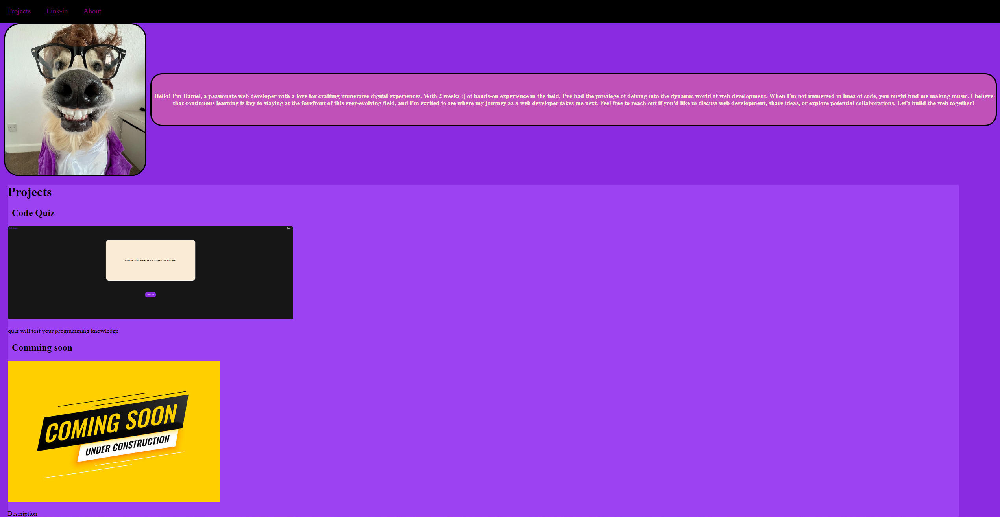

# Module 2 - Weekly Challenge - Advanced CSS Challenge - Professional Portfolio

## Description
 My website development portfolio. containing my avatar, linkIn profile/resume, side projet a chess board and templates for future applications. 

## Deployed Page

[Deployed GitPage](https://rrwx.github.io/Professional-Portfolio-CSS-Challenge/)

 ## Contributions
 **Authors and Resources**: 
 ### W3Schools
 [W3Schools HTML & CSS Resources](https://www.w3schools.com/)
 ### CSS Tricks
 [Guide to Flexbox](https://css-tricks.com/snippets/css/a-guide-to-flexbox/)
 ### 
 **Code by** Daniel Wooalrd 
